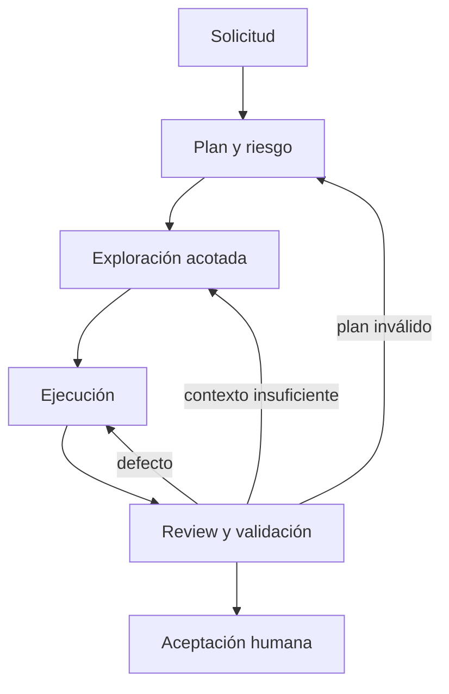

# Visión del sistema

## Propósito

Transformar una solicitud en un cambio revisado y validado, con contexto mínimo,
roles separados y aceptación humana.

## Componentes

| Componente | Responsabilidad | Autoridad |
| --- | --- | --- |
| Codebase | dispatch, sesiones y herramientas | operacional |
| contratos `.ai/` | estados, roles, prompts, schemas y gates | canónica para agentes |
| FitFlow | código, tests, config y docs de producto | ejecutable/canónica |
| FitFlow-ai | inventarios, parsing, Repomix, ingesta, retrieval y trazas | derivada |
| persona | aprobación, riesgo alto, integración y `DONE` | final |

## Flujo de información

## Invariantes

1. La tarea se clasifica `backend`, `frontend` o `mixed` antes de buscar.
2. Un Coder recibe evidencia, no un volcado de repositorio.
3. Reviewer y Validator son independientes del Coder.
4. Ningún agente integra cambios o ejecuta riesgo alto.
5. Los artefactos derivados declaran baseline y staleness.
6. El paralelismo requiere ownership disjunto.
7. Cada transición produce un artefacto validable.

## Límites

Codebase orquesta desarrollo. LlamaIndex orquesta ingesta y retrieval, no el
ciclo de vida de la tarea. Repomix/repo-packager extrae estructura, Qdrant almacena
vectores, Repomix crea snapshots y Phoenix observa; ninguno decide arquitectura.
